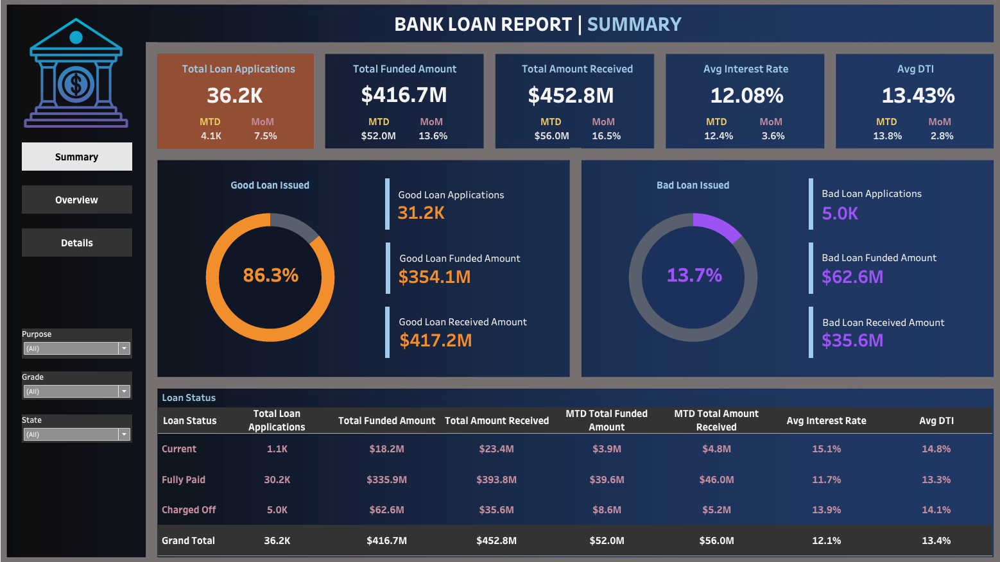
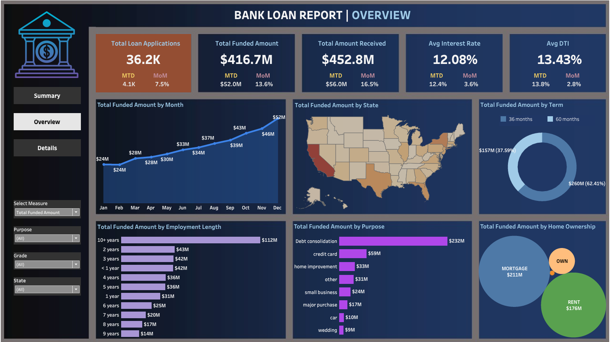
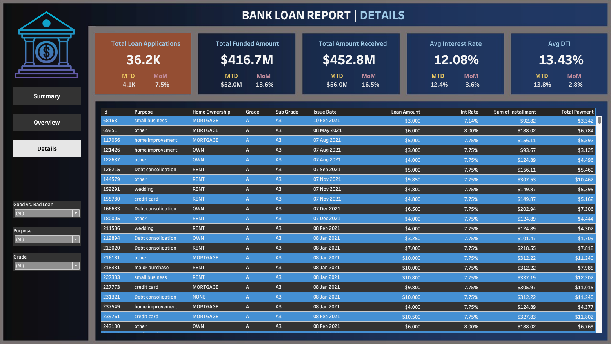

 
  

# Bank Loan Analysis Project

## Project Overview
This project involves analyzing bank loan data using SQL and Tableau to derive insights and visualize key metrics. The main objective is to analyze borrower characteristics, evaluate risk factors, and gain valuable insights into the loan approval process, enabling more informed decision-making for strategic banking initiatives.

## Tools and Technologies
**SQL**: For querying the database to extract and manipulate data. 
**Excel**: For data cleaning, processing, and preliminary analysis. 
**Tableau**: For building interactive dashboards to visualize the data.

## Data Source
**Bank Loan Database**: Contains various aspects of bank loans, including Loan ID, Address State, Purpose, Grade, Sub Grade, Annual Income, Loan Status, Last Payment Date, Verification Status, Debt-to-Income Ratio, and Interest Rates. These fields offer valuable information about borrower demographics, employment consistency, loan attributes, risk evaluation, and payment patterns.

## SQL Queries
SQL queries were utilized to validate the accuracy of the numbers displayed in the Tableau visualizations.

## Tableau
### Dashboard 1: Summary
This dashboard provides Key Performance Indicators (KPIs) 
#### Key Performance Indicators (KPIs) Requirements:
1. **Total Loan Applications:** Calculate the total number of loan applications received during a specified period. Additionally, tracking Month-to-Date (MTD) and Month-over-Month (MoM) changes.
2.	**Total Funded Amount:** Calculate the total amount of funds disbursed as loans, MTD, and MoM changes.
3.	**Total Amount Received:** Calculate the total amount received from borrowers, MTD, and MoM changes.
4.	**Average Interest Rate:** Calculate the average interest rate across all loans, MTD, and monitoring the Month-over-Month (MoM) variations.
5.	**Average Debt-to-Income Ratio (DTI):** Calculate the average DTI for borrowers, MTD, and track MoM fluctuations.

#### Loan Status Grid View
To gain a comprehensive understanding of our lending operations and track loan performance, we plan to develop a grid view report categorized by 'Loan Status.' This report will be an essential tool for analyzing and interpreting key metrics associated with various loan statuses. It will provide insights into critical indicators such as 'Total Loan Applications,' 'Total Funded Amount,' 'Total Amount Received,' 'Month-to-Date (MTD) Funded Amount,' 'MTD Amount Received,' 'Average Interest Rate,' and 'Average Debt-to-Income Ratio (DTI).' By leveraging these insights, we can make informed, data-driven decisions and evaluate the overall health of our loan portfolio effectively.

### Dashboard 2: Overview
1. **Line chart:** Analyzes monthly trends by issue date.
2. **Filled Map:** Regional analysis by state.
3. **Donut Chart:** Loan term analysis across various term lengths.
4. **Bar Chart:** Analyzes lending metrics by borrowers' employment lengths.
5. **Bar Chart:** Analyzes loan metrics by loan purpose.
6. **Packed Circles:** Analyzes home ownership.

### Dashboard 3: Details
This dashboard provides a consolidated view of all the essential information within the bank loan data.

## Output
### Dashboard 1: Summary

### Dashoard 2: Overview

### Dashboard 3: Details

